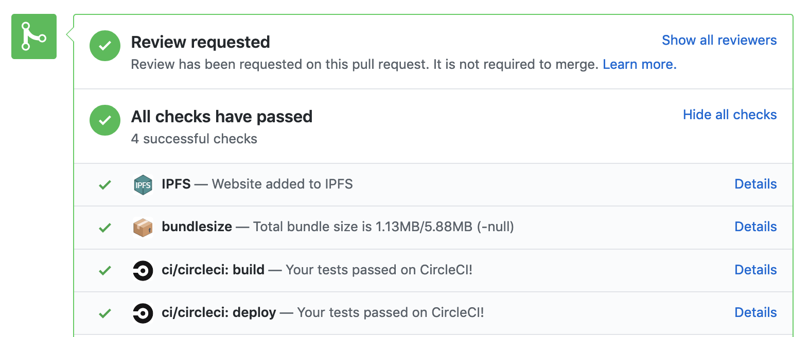

# IPFS GitHub Action

Publish websites to IPFS as part of a github action workflow. This action pins a directory to IPFS by using the ipfs-cluster-ctl command to pin it to a remote IPFS Cluster. It sets the IPFS URL as a status on the commit that triggered the action, allowing easy previewing of rendered static sites on the dweb.

**NOTE:** You need to provide **credentials to an IPFS cluster** instance that you have permission to pin to, in order to make use of this action.

This action uses https://github.com/ipfs-shipyard/ipfs-dns-deploy to do the work.



## Usage

Use this action from a workflow that build out your static site to a directory. In this example we ask ipfs-github-action to pin the `public` dir in the current workspace to cluster.ipfs.io

```yaml
- uses: ipfs-shipyard/ipfs-github-action@v2
  id: ipfs
  with:
    path_to_add: public
    cluster_host: /dnsaddr/cluster.ipfs.io
    cluster_user: ${{ secrets.CLUSTER_USER }}
    cluster_password: ${{ secrets.CLUSTER_PASSWORD }}
  env:
    GITHUB_TOKEN: ${{ secrets.GITHUB_TOKEN }}

# "bafkreicysg23kiwv34eg2d7qweipxwosdo2py4ldv42nbauguluen5v6am"
- run: echo /ipfs/${{ steps.ipfs.outputs.cid }}

# https://bafkreicysg23kiwv34eg2d7qweipxwosdo2py4ldv42nbauguluen5v6am.ipfs.dweb.link
- run: echo ${{ steps.ipfs.outputs.url }}
```

Check the [filecoin spec website workflow](https://github.com/filecoin-project/specs/blob/71f37208a1f4f56b33ea307d7cbdb4b06996b115/.github/workflows/main.yml) for a complete example out in the wild that also updates a DNSLink record when with the new cid when a commit changes the production branch.


## Inputs

### `path_to_add`

**Required** The path the root directory of your static website or other content that you want to publish to IPFS.

### `cluster_user`

**Required** Username for the IPFS Cluster instance

### `cluster_password`

**Required** Password for the IPFS Cluster instance

### `cluster_host`

**Required** Multiaddr for the IPFS Cluster. - see: https://cluster.ipfs.io/
_Default_ `/dnsaddr/cluster.ipfs.io`

### `ipfs_gateway`

**Required** IPFS subdomain gateway to use for preview url - see: https://docs.ipfs.io/concepts/ipfs-gateway
_Default_ `dweb.link`

If you'd prefer to use `/ipfs/<cid>` style preview urls, then v1 of this action is the one for you! 

see: https://github.com/ipfs-shipyard/ipfs-github-action/releases/tag/v1.0.0


## Outputs

### `cid`

The IPFS content identifier for the directory on IPFS. 
e.g. `bafkreicysg23kiwv34eg2d7qweipxwosdo2py4ldv42nbauguluen5v6am`

More info on CIDs: https://docs.ipfs.io/concepts/content-addressing/

### `url`

The URL for the IPFS gateway to preview the content over https.
e.g. https://bafkreicysg23kiwv34eg2d7qweipxwosdo2py4ldv42nbauguluen5v6am.ipfs.dweb.link

More info on IPFS Gateways: https://docs.ipfs.io/concepts/ipfs-gateway

## Contribute

Feel free to dive in! [Open an issue](https://github.com/ipfs-shipyard/ipfs-action/issues/new) or submit PRs.

To contribute to IPFS in general, see the [contributing guide](https://github.com/ipfs/community/blob/master/contributing.md).

[](https://github.com/ipfs/community/blob/master/CONTRIBUTING.md)


## License

[MIT](LICENSE) © Protocol Labs


[`ipfs-cluster-ctl`]: https://cluster.ipfs.io/documentation/ipfs-cluster-ctl/
[`entrypoint.sh`]: scripts/pin-to-cluster.sh
